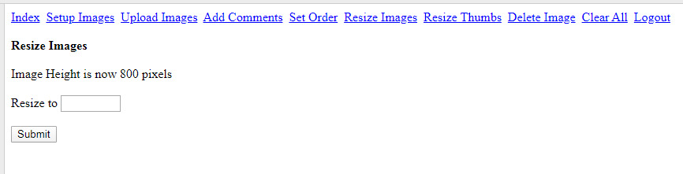

### PHP-ImageGallery
PHP Gallery with SQLite backend. Images and thumbs are stored in the database. Upload of images.

Here is the backend for administration:

#### Instructions  
1. Upload everything to your server.  
2. Put your images into the /images/ directory.  
3. Load index.php and follow instructions.  
4. Log in.  
5. Run the 'Setup Images'.  

Imagick is used, but GD is also supported. 
Images and thumbs are all stored as WEBP images. 
It is possible to add description to each image. 
PHP Image Gallery is tested to work 
with Firefox, Chrome and Internet Explorer browsers.
